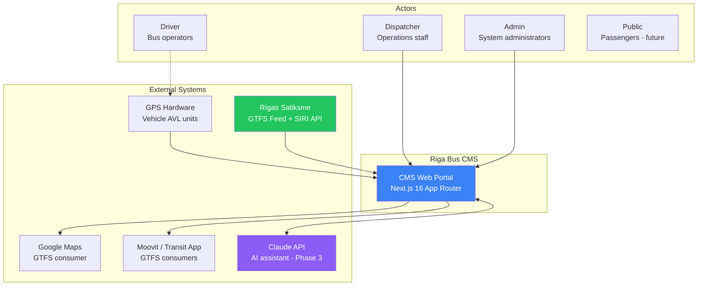
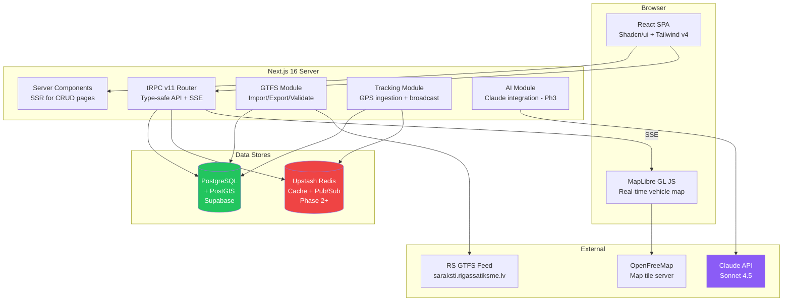
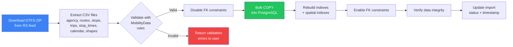
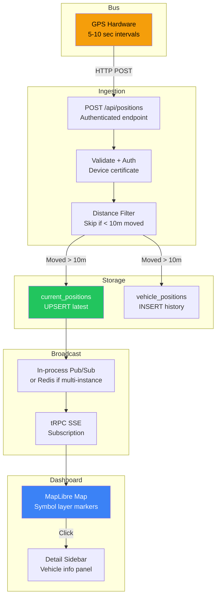
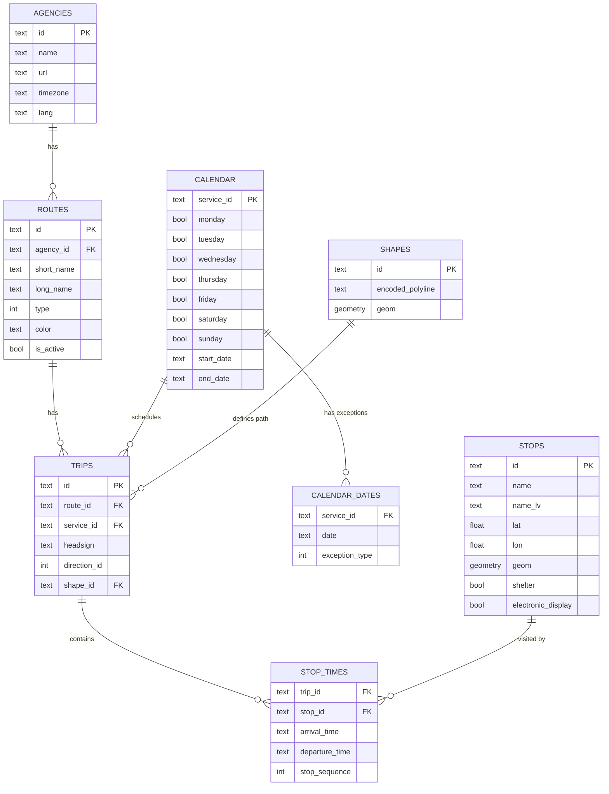
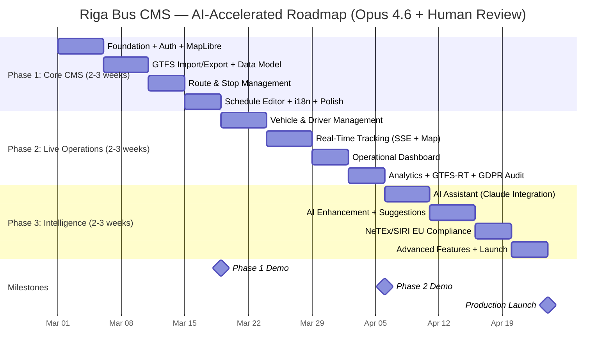

# Architecture Diagrams — Riga Bus CMS

## 1. System Architecture (C4 Level 1 — Context)



## 2. Container Diagram (C4 Level 2)



## 3. Data Flow — GTFS Import Pipeline



## 4. Data Flow — Real-Time Tracking (Phase 2)



## 5. Database ER Diagram (Core GTFS)



## 6. Database ER Diagram (Fleet & Tracking — Phase 2)

```mermaid
erDiagram
    VEHICLES ||--o{ CURRENT_POSITIONS : "has"
    VEHICLES ||--o{ VEHICLE_POSITIONS : "tracked at"
    TRIPS ||--o{ CURRENT_POSITIONS : "running"
    DRIVERS ||--o{ SHIFT_ASSIGNMENTS : "works"
    VEHICLES ||--o{ SHIFT_ASSIGNMENTS : "assigned to"

    VEHICLES {
        text id PK
        text registration_number UK
        text type
        text make_model
        int capacity
        bool is_accessible
        text status
        text gps_device_id
    }

    DRIVERS {
        text id PK
        text employee_code UK
        text license_category
        date license_expiry
        text status
    }

    CURRENT_POSITIONS {
        text vehicle_id PK_FK
        text trip_id FK
        text route_id
        float lat
        float lon
        float bearing
        float speed
        timestamp timestamp_tz
        text status
    }

    VEHICLE_POSITIONS {
        serial id PK
        text vehicle_id FK
        text trip_id FK
        float lat
        float lon
        float bearing
        float speed
        timestamp timestamp_tz
        int schedule_adherence_sec
    }

    SHIFT_ASSIGNMENTS {
        serial id PK
        text driver_id FK
        text vehicle_id FK
        date shift_date
        text shift_type
    }
```

## 7. Authentication & Authorization Flow

```mermaid
flowchart TB
    subgraph "Client"
        LOGIN[Login Form]
        DASH[Dashboard]
    end

    subgraph "Auth.js v5"
        MW[Middleware<br/>Route protection]
        JWT_CB[JWT Callback<br/>Add role to token]
        SESS_CB[Session Callback<br/>Expose role]
    end

    subgraph "Protected Routes"
        ADM[/admin/*<br/>role: admin]
        DISP[/tracking/*<br/>role: dispatcher+]
        EDIT[/routes/*, /schedules/*<br/>role: editor+]
        VIEW[/reports/*<br/>role: viewer+]
    end

    LOGIN -->|Credentials| JWT_CB
    JWT_CB -->|Token with role| SESS_CB
    SESS_CB --> MW
    MW -->|role=admin| ADM
    MW -->|role=dispatcher| DISP
    MW -->|role=editor| EDIT
    MW -->|role=viewer| VIEW
    MW -->|Unauthorized| LOGIN

    style ADM fill:#ef4444,color:#fff
    style DISP fill:#f59e0b,color:#000
    style EDIT fill:#3b82f6,color:#fff
    style VIEW fill:#22c55e,color:#fff
```

## 8. Phase Delivery Timeline (AI-Accelerated)



## 9. AI Agent Decision Flow (Phase 3)

```mermaid
flowchart TB
    USER[Dispatcher types query<br/>"Which buses are late?"]

    subgraph "Query Router"
        CLASS{Classify<br/>Haiku 4.5<br/>$0.001/query}
        SIMPLE[Simple lookup]
        COMPLEX[Complex analysis]
    end

    subgraph "Tool Execution"
        T1[query_bus_status<br/>→ SQL query]
        T2[get_route_schedule<br/>→ SQL query]
        T3[get_adherence_report<br/>→ Aggregation]
    end

    subgraph "Response Generation"
        GEN[Sonnet 4.5<br/>Format response<br/>~$0.03/query]
    end

    subgraph "Display"
        CHAT[Chat response<br/>"3 buses are late:..."]
        ACTION[Quick actions<br/>[View on Map] [Details]]
    end

    USER --> CLASS
    CLASS -->|Simple| SIMPLE --> T1
    CLASS -->|Complex| COMPLEX --> GEN
    T1 --> GEN
    T2 --> GEN
    T3 --> GEN
    GEN --> CHAT
    GEN --> ACTION

    style CLASS fill:#8b5cf6,color:#fff
    style GEN fill:#8b5cf6,color:#fff
    style USER fill:#3b82f6,color:#fff
```
